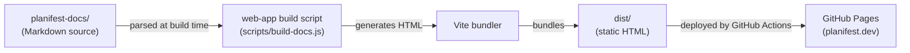

# Architecture Overview

> Living document. Reflects current system state. Updated after every pipeline run.
> Do not archive this file — update it in place.

Last updated: 0000003-p9-phase-docs

---

## System Summary

The Planifest docs system is a static documentation website for the Planifest framework, served via GitHub Pages. It is authored as markdown source files, compiled to HTML at build time by a Node.js script, bundled by Vite, and deployed automatically on merge to `main`. The system has no runtime backend, no user authentication, and no data storage.

---

## Components

| Component | Type | Purpose | Status |
|-----------|------|---------|--------|
| `planifest-docs` | content | Markdown source for all documentation pages | active |
| `web-app` | static site | Builds and serves the documentation site | active |
| `planifest-framework` | dev dependency | Provides the confirmed-design pipeline that governs development of this repo | active |

---

## Communication Patterns

---

## Data Ownership

| Data Store | Owner | Consumers |
|------------|-------|-----------|
| `planifest-docs/*.md` | `planifest-docs` | `web-app` (read-only at build time) |
| `src/web-app/docs.manifest.json` | `web-app` | `web-app` build script (page ordering/titles) |

No runtime database. No persistent user data.

---

## External Dependencies

| Dependency | Type | Components That Use It |
|------------|------|----------------------|
| GitHub Pages | hosting | `web-app` (deployment target) |
| GitHub Actions | CI/CD | `web-app` (build and deploy workflow) |
| Vite 7 | npm | `web-app` |
| marked 17 | npm | `web-app` (markdown → HTML) |
| mermaid 11 | npm | `web-app` (diagram rendering) |

---

## Key Architectural Decisions

See `docs/decisions-index.md` for the full list. Decisions that most shape the current architecture:

- **ADR-001 (website)**: Static site generation with Vite — no SSR, no backend, pure static output
- **ADR-002 (website)**: Build-time markdown rendering — docs are compiled, not interpreted at runtime
- **ADR-003 (website)**: Deployment via GitHub Actions to GitHub Pages
- **ADR-001 (0000001)**: `docs.manifest.json` as single source of truth for page order and titles
- **ADR-001 (0000003)**: `planifest-docs` formalised as a tracked component with a `component.yml` manifest

---

*Template: architecture-overview.template.md*
