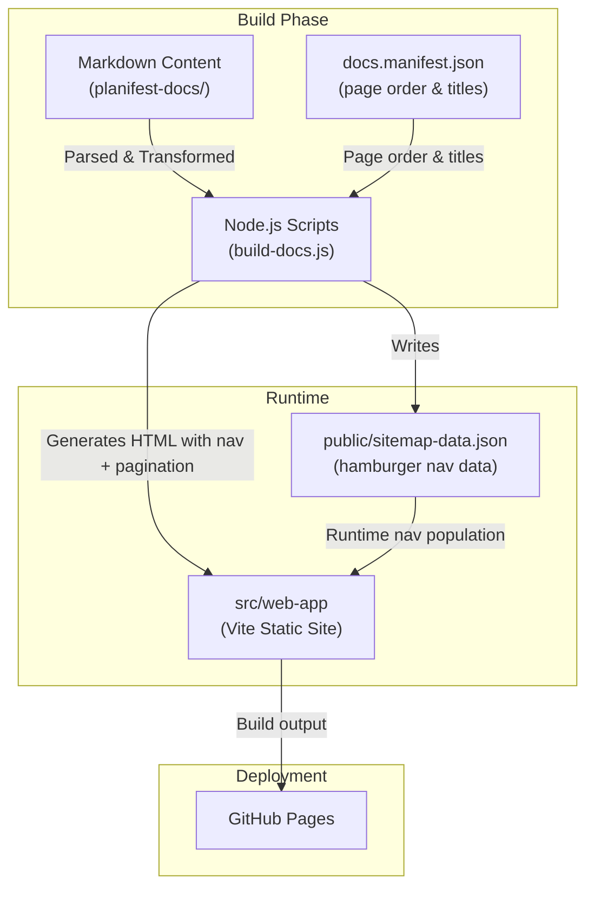

# Dependency Graph

```mermaid
graph TD
    subgraph Build Phase
        md["Markdown Content\n(planifest-docs/)"]
        manifest["docs.manifest.json\n(page order & titles)"]
        builder["Node.js Scripts\n(build-docs.js)"]
    end
    
    subgraph Runtime
        webapp["src/web-app\n(Vite Static Site)"]
        sitemap["public/sitemap-data.json\n(hamburger nav data)"]
    end
    
    subgraph Deployment
        ghpages["GitHub Pages"]
    end

    md -- "Parsed & Transformed" --> builder
    manifest -- "Page order & titles" --> builder
    builder -- "Generates HTML with nav + pagination" --> webapp
    builder -- "Writes" --> sitemap
    sitemap -- "Runtime nav population" --> webapp
    webapp -- "Build output" --> ghpages
```
