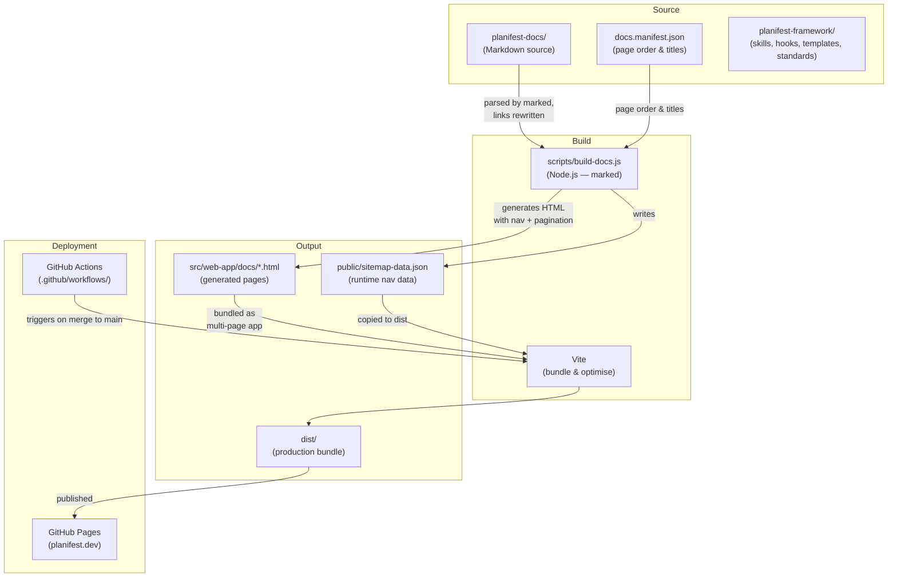
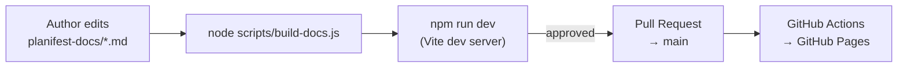
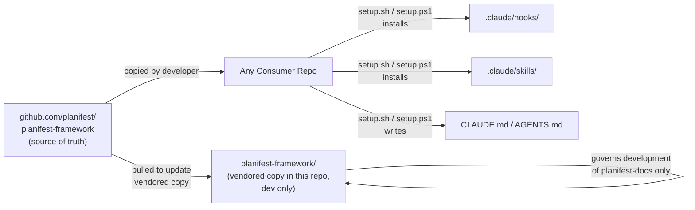

# Dependency Graph

Last updated: 0000003-p9-phase-docs

---

## Build Pipeline

---

## Content Authoring Flow

---

## planifest-framework (dev dependency only)

`planifest-framework/` is a vendored copy used exclusively to manage development of this repo — it is not part of the build output and is not shipped with the site. It has no role at compile time or runtime for the web-app.

The authoritative framework source is at [github.com/planifest/planifest-framework](https://github.com/planifest/planifest-framework). Consumer repos obtain the framework directly from there — not from this repo.

