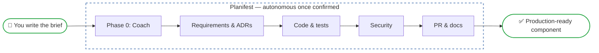

# What is Planifest

Planifest is a requirements framework for agentic development. It gives AI agents the structured context they need to build software correctly — without guessing, hallucinating, or drifting from intent.

## The Problem

Agentic AI tools are powerful but stochastic. Left without structure, an agent improvises: it fills gaps with training data, makes architectural choices without your context, and produces code that works in isolation but breaks at integration. The more complex the feature, the wider the gap between what you intended and what gets built.

## The Solution

Planifest introduces a **confirmed design** — a locked requirements document that agents work against instead of their training data. Before any code is written, a human and an agent go through a structured coaching conversation that produces a complete specification:

- What is being built and why (user stories, acceptance criteria)
- What constraints apply (performance, security, data ownership)
- What architecture decisions have been made (stack, component boundaries, deployment)

Once confirmed, that design is immutable for the pipeline run. Agents generate code, tests, documentation, and a security review against it. The result is a production-ready pull request — not a prototype.

## Three Layers

Every feature in Planifest is described across three layers:

| Layer | Covers |
|-------|--------|
| **Product** | Functional requirements: what the system must do and why. User stories, acceptance criteria, constraints, known integrations. |
| **Architecture** | Standards: non-functional requirements and cross-cutting rules. Performance targets, security constraints, observability, API versioning. |
| **Engineering** | Implementation: stack declaration, component design, data ownership, deployment topology, infrastructure. |

All three must be complete before code generation begins.

## Key Concepts

**Feature Brief** — A human-authored document describing what to build. The starting point for every pipeline run.

**Phase 0 — Assess and Coach** — The orchestrator agent reads the brief, identifies gaps across all three layers, and asks the human to fill them — one question at a time. The output is the confirmed design.

**Confirmed Design** — The locked plan at `plan/current/design.md`. Defines what will be built, against what constraints, with what architecture. Immutable once confirmed.

**The Pipeline** — Nine phases that take the confirmed design to a production-ready pull request. Each phase is driven by a dedicated skill.

**Three Tracks** — Not every change needs the full pipeline. Planifest routes requests to the appropriate track: Feature Pipeline (new features), Change Pipeline (targeted changes), or Fast Path (trivial fixes).

## How It Works

Planifest is delivered as a set of **Agent Skills** — files that compatible AI tools discover and load automatically. The orchestrator skill is the entry point. It drives the entire pipeline and invokes the right skill at each phase.

## Supported Tools

Claude Code, Cursor, GitHub Copilot, Windsurf, Cline, and Codex. See [Getting Started](02-getting-started.md) for setup.
